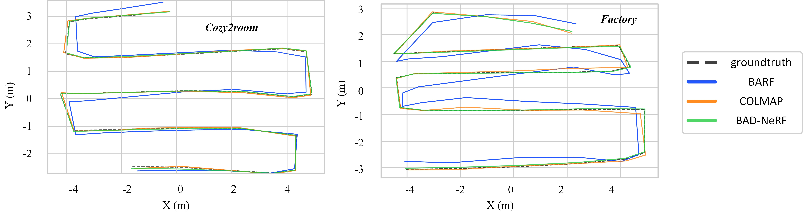

# 😈BAD-NeRF

<a href="https://arxiv.org/abs/2211.12853"></a>
<a href="https://opensource.org/licenses/MIT"></a>
<a href="https://www.youtube.com/watch?v=xoES4eONYoA"></a>

This is a PyTorch implementation of the paper [BAD-NeRF: Bundle Adjusted Deblur Neural Radiance Fields](https://arxiv.org/abs/2211.12853) (CVPR 2023). Authors: [Peng Wang](https://github.com/wangpeng000), [Lingzhe Zhao](https://github.com/LingzheZhao), Ruijie Ma and [Peidong Liu](https://ethliup.github.io/). 

BAD-NeRF jointly learns the 3D representation and optimizes the camera motion trajectories within exposure time from blurry images and inaccurate initial poses.

Here is the [Project page](https://wangpeng000.github.io/BAD-NeRF/).

## Novel View Syhthesis 
<div><video autoplay loop controls src="https://user-images.githubusercontent.com/43722188/232816090-ced1fbbc-4246-45c6-a265-e7424e754c7b.mp4" muted="true"></video></div>

## Deblurring Result


## Pose Estimation Result


## Method overview


We follow the real physical image formation process of a motion-blurred image to synthesize blurry images from NeRF. Both NeRF and the motion trajectories are estimated by maximizing the photometric consistency between the synthesized blurry images and the real blurry images.

## Quickstart

### 1. Setup environment

```
git clone https://github.com/WU-CVGL/BAD-NeRF
cd BAD-NeRF
pip install -r requirements.txt
```

### 2. Download datasets

You can download the data and weights [here](https://westlakeu-my.sharepoint.com/:f:/g/personal/cvgl_westlake_edu_cn/EsgdW2cRic5JqerhNbTsxtkBqy9m6cbnb2ugYZtvaib3qA?e=bjK7op).

For the scenes of Deblur-NeRF (*cozy2room*, *factory* etc.), the folder `images` only includes blurry images and the folder `images_1` additionally includes novel view images. But for our scenes (*room-low*, *room-high* and *dark*), there are no novel view images. Note that the images in the *dark* scene are undistorted, causing that there are some useless pixels, and you should uncomment the code of `Graph.forward` in `nerf.py`.

### 3. Configs

Change the data path and other parameters (if needed) in `configs/cozy2room.txt`. We use *cozy2room* scene as an example.

### 4. Demo with our pre-trained model

You can test our code and render sharp images with the provided weight files. To do this, you should first put the weight file under the corresponding logs folder `./logs/cozy2room-linear`, and then change the parameter `load_weights=True` in `cozy2room.txt`, finally run

```
python test.py --config configs/cozy2room.txt
```

### 5. Training

```
python train.py --config configs/cozy2room.txt
```

After training, you can get deblurred images, optimized camera poses and synthesized novel view images.

## Notes

### Camera poses

The poses (`poses_bounds.npy`) are generated from only blurred images (folder `images`) by COLMAP.

### Spline model

We use `linear interpolation` as the default spline model in our experiments, you can simply change the parameter `linear` (all the parameters can be changed in `configs/***.txt` or `run_nerf.py`) to `False` to use the higher-order spline model (i.e. `cubic B-Spline`).

### Virtual images

You can change the important parameter `deblur_images` to a smaller/bigger value for lightly/severely blurred images.

### Learning rate

After rebuttal, we found that sometimes the gradients will be NaN if `cubic B-Spline` model with a `pose_lrate=1e-3` is used. Therefore, we set the initial pose learning rate to 1e-4 and it may achieve a better performance compared to that in our paper. If the gradient appears NaN in your experiments unfortunately, just kill it and try again or decrease the `pose_lrate`.

## Your own data

`images`: This folder is used to estimate initial camera poses from blurry images. Specifically, just put your own data in the folder `images` (only blurry images), and run `imgs2poses.py` script from the [LLFF code](https://github.com/fyusion/llff) to estimate camera poses and generate `poses_bounds.npy`.

`images_1`: This is the default training folder, which includes the same blurry images in `images` folder and (optional) several novel view sharp images. If you want to add novel view images (sharp images), please put them into the folder `images_1` with an interval of `llffhold` (a parameter used for novel view testing). Remember that, set parameter `novel_view` to `True` if `images_1` includes novel view images. Otherwise, if there are no novel view images, you can directly put the blurry images to the folder `images_1` and set parameter `novel_view` to `False`.

`images_test`: To compute deblurring metrics, this folder contains ground truth images theoretically. However, you can copy the blurry images in `images` folder to `images_test` folder if you don't have ground truth images, which is the easiest way to run the code correctly (remember the computed metrics are wrong).
```
#-----------------------------------------------------------------------------------------#
# images folder: img_blur_*.png is the blurry image.                                      #
#-----------------------------------------------------------------------------------------#
# images_1 folder: img_blur_*.png is the same as that in `images` and (optional)          #
# img_novel_*.png is the sharp novel view image.                                          #
#-----------------------------------------------------------------------------------------#
# images_test folder: img_test_*.png should be the ground truth image corrseponds to      #
# img_blur_*.png to compute PSNR metric. Of course, you can directly put img_blur_*.png   #
# to run the code if you don't have gt images (then the metrics are wrong).               #
#-----------------------------------------------------------------------------------------#
images folder: (suppose 10 images)
img_blur_0.png
img_blur_1.png
.
.
.
img_blur_9.png
#-----------------------------------------------------------------------------------------#
images_1 folder: (suppose novel view images are placed with an `llffhold=5` interval.)
img_novel_0.png (optional)
img_blur_0.png
img_blur_1.png
.
img_blur_4.png
img_novel_1.png (optional)
img_blur_5.png
.
img_blur_9.png
img_novel_2.png (optional)
#-----------------------------------------------------------------------------------------#
images_test folder: (theoretically gt images, but can be other images)
img_test_0.png
img_test_1.png
.
.
.
img_test_9.png
```
## Citation

If you find this useful, please consider citing our paper:

```bibtex
@InProceedings{wang2023badnerf,
    author    = {Wang, Peng and Zhao, Lingzhe and Ma, Ruijie and Liu, Peidong},
    title     = {{BAD-NeRF: Bundle Adjusted Deblur Neural Radiance Fields}},
    booktitle = {Proceedings of the IEEE/CVF Conference on Computer Vision and Pattern Recognition (CVPR)},
    month     = {June},
    year      = {2023},
    pages     = {4170-4179}
}
```

## Acknowledgment

The overall framework, metrics computing and camera transformation are derived from [nerf-pytorch](https://github.com/yenchenlin/nerf-pytorch/), [Deblur-NeRF](https://github.com/limacv/Deblur-NeRF) and [BARF](https://github.com/chenhsuanlin/bundle-adjusting-NeRF) respectively. We appreciate the effort of the contributors to these repositories.
